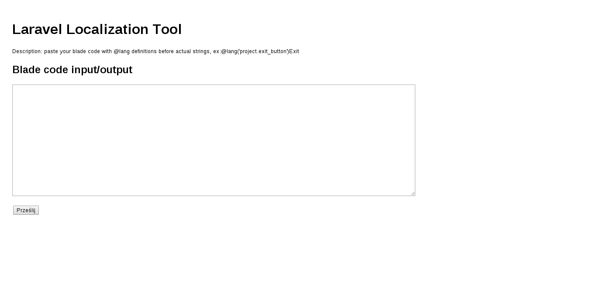

Laravel Localization Tool
=========================

Simple tool to help with localization process on laravel template files.



##Contribute!
If you want to handle some extra scenarios in your blade templates please contact with me through issues tab.

##Input
Laravel Blade template with @lang definitions before correct strings. Examples below.

```
<p class="status">
    @lang('projects.project_status')Status
</p>
```

##Output
Laravel localization array and blade template with cut off ogiriginal strings.

```
<?php
return array(
    'project_status' => 'Status',
);
```

```
<p class="status">
    @lang('projects.project_status')
</p>
```

##Roadmap
* add warnings about strings without @lang definition

