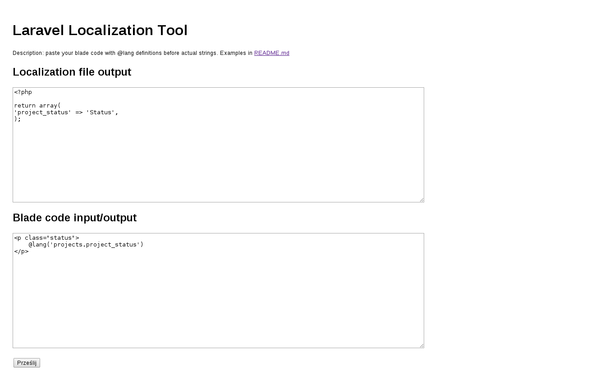

Laravel Localization Tool
=========================

Simple tool to help with localization process on laravel template files.

##Screenshot


##Example
You can check demo [here](http://maciejplusa.com/laravel-localization-tool/)

##Instructions
1. Open blade template in your favorite code editor.
1. Add @lang('filename.key') before every string you can get in localization array.
1. Copy blade template into localization tool and send it.
1. After that you get code for localization file and parsed blade template without original strings.
1. Copy those to your project files.
1. Repeat process with your next blade template.

##Contribute!
If you want to handle some extra scenarios in your blade templates please contact with me through issues tab.

##Input
Laravel Blade template with @lang definitions before correct strings. Examples below.

```
<p class="status">
    @lang('projects.project_status')Status
</p>
```

##Output
Laravel localization array and blade template with cut off ogiriginal strings.

```
<?php
return array(
    'project_status' => 'Status',
);
```

```
<p class="status">
    @lang('projects.project_status')
</p>
```

##Roadmap
* add warnings about strings without @lang definition

